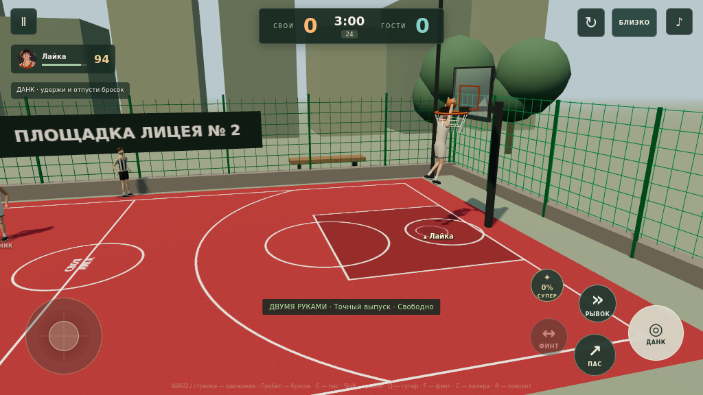
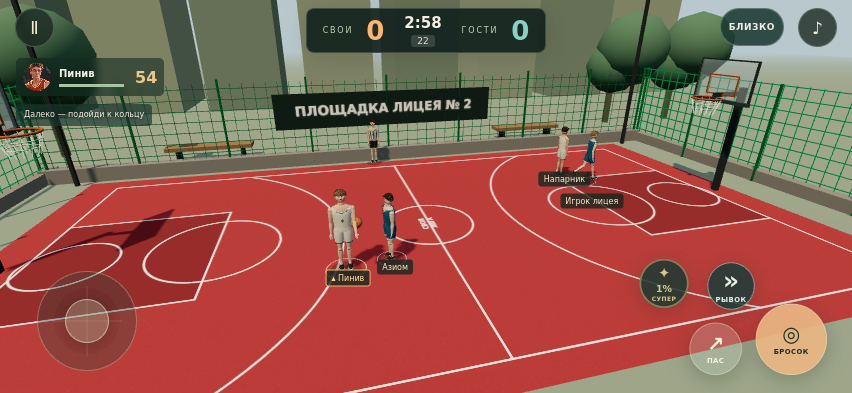

# Своя лига — версия 0.4

Браузерный 3D-баскетбол 2 на 2 для телефона и компьютера. Один выбранный герой остаётся под управлением игрока весь матч; напарник и соперники — боты. Все необходимые изображения и Three.js включены в сборку. Платные API и серверная часть игре не нужны.

## Обновление 0.4

- Ведение синхронизировано с ладонью и корпусом, включая ведение на месте. Есть смена ведущей руки кнопкой «ФИНТ», защита свободной рукой и подготовка передачи от груди.
- Четыре завершения: данк двумя руками, одной рукой с разбега, обратный данк и томагавк. Тип зависит от характеристик, скорости, стороны захода и защиты. Мяч удерживается до кольца; видны отталкивание, работа руки, реакция кольца и приземление. Возможны промах и блок.
- Бросок и проход имеют отдельную подготовку, прыжок, выпуск и сопровождение кистью. После выпуска мяч летит по параболе с постоянным ускорением падения.
- Ноги ставятся на площадку во время опорной фазы; ускорение, остановки и контакт с защитником учитывают скорость. Боты видят подготовку атаки, а после паса могут открыться к кольцу.
- Камера ниже, подписи и сообщения сдержаннее. Добавлены звуки ведения, передачи, кольца, сетки и данка.
- Кнопка ↻ включает горизонтальный режим. Если браузер не позволяет системный поворот, поворачивается вся игровая область с кнопками и окнами паузы/результата. Джойстик учитывает этот поворот.

Анимации созданы процедурно для этой игры. Это развитие небольшого браузерного прототипа в сторону более естественного баскетбола, без motion capture и качества движений уровня NBA 2K. Подробности: [геймплей 0.4](docs/gameplay-v04.md).

## Сохранено из версии 0.3

- Броски зависят от момента выпуска, характеристик, дистанции, скорости, усталости и давления защитника. Игрок и боты используют одну формулу. Идеальный выпуск не гарантирует трёхочковое попадание.
- Появились обманный замах коротким нажатием и рывок за выносливость. Броски ботов имеют видимую подготовку; блок и перехват требуют правильного момента и имеют восстановление. Пасы летят в выбранную точку, а после промаха можно побороться за подбор.
- Новый игрок начинает за Пинива с отдельным напарником. Герои открываются за доигранные победы: Азиом — 1, Демидок — 3, Габар — 6, Кемпиль — 10, Лайка — 15. Прошлые сохранённые победы засчитываются. Покупки и монеты не нужны.
- Головы меньше относительно тела, плечи и руки скорректированы, кроссовки длиннее. Движение сглажено, есть работа коленей и корпуса, отдельная высота прыжка и движение рук при данке.
- Красное покрытие, белая разметка, зелёный забор и баннер «Площадка лицея № 2». Светлая форма своей команды помогает различать игроков на красном фоне.
- Более низкая камера плавно следует за игрой. Кнопка «БЛИЗКО / ОБЗОР» переключает ракурс.

## Изменения внешности

- Семь новых портретов по исходным референсам: шесть игроков в баскетбольной форме и Аскар в форме судьи. Они используются в карточках и интерфейсе матча.
- Фотографии полностью убраны с поверхности 3D-лиц. Голова, нос, щёки, подбородок, веки, глаза, губы и уши имеют объёмную геометрию. У героев различаются параметры формы лица, волосы, телосложение и рост. Азиом носит объёмные очки.
- Более естественные пропорции тела, отдельные пальцы, ткань формы, кроссовки, сгибы локтей и коленей.
- Просмотр героя с поворотом и кнопкой «Лицо крупнее». Ссылка «Сравнить всех персонажей» показывает именно игровые модели.
- Более нейтральный дневной свет, прозрачные баскетбольные щиты, металлические рамки и фактура покрытия.

Портреты — отдельные детальные иллюстрации, созданные по фото. Игровые 3D-модели остаются стилизованными: это вручную заданная интерпретация черт внешности, а не трёхмерные сканы. Вид в 3D-просмотре соответствует модели в матче. Точное сходство ещё можно корректировать по замечаниям автора.

## Запуск

Открой папку проекта в редакторе с локальным веб-сервером. Если установлен Python, в папке проекта выполни `python -m http.server 8000`, затем открой `http://localhost:8000`.

Двойной клик по index.html не подходит: браузер блокирует модули при открытии через file://.

Игра опубликована на GitHub Pages: **[Играть в «Свою лигу»](https://layka2.github.io/svoya-liga/)**. Эту ссылку можно отправить друзьям; на телефоне открывай её в браузере и играй горизонтально. Регистрация в GitHub для игры не нужна.

Публикация настроена из ветки `main`, папки `/ (root)`. После сохранения изменений GitHub Pages обновляет сайт автоматически. Хостинг и адрес `github.io` бесплатны для этого публичного репозитория; домен покупать не нужно. В сборку входят новые игровые портреты, исходные фотографии в репозитории не размещены.

## Управление

- Телефон: горизонтально; слева джойстик, справа кнопки действий. Если всё вертикально, нажми «ПОВЕРНУТЬ И ИГРАТЬ» или ↻.
- Бросок: удерживать и отпустить в зелёной зоне. Для данка разгонись к кольцу: кнопка сменится на «ДАНК». Отпусти её в нужный момент; слабые данкеры чаще выполняют проход с броском.
- Короткое касание броска — обманный замах; отдельная кнопка «Рывок» — ускорение.
- Финт: сменить ведущую руку перед защитником.
- Пас: отдать передачу; когда мяч у напарника — попросить её.
- Защита: блок и перехват. Для перехвата нужно подойти к сопернику.
- Суперприём: нажать после заполнения шкалы. У каждого героя свой эффект.
- Компьютер: WASD/стрелки, пробел — бросок, E — пас/перехват, Q — супер, Shift — рывок, F — финт, C — камера, R — поворот, Esc — пауза.

## Возможности

Карточки шести игроков и рейтинги 1–99; выбор своего героя и напарника; смена соперников; судья Аскар; 3D-просмотр; два кольца; броски на 2 и 3 очка; пасы и запросы передачи; дриблинг; данки; прыжки, перехваты и блоки; подборы; суперприёмы; боты; пауза; результат матча; звук; запоминание команды и результатов в текущем браузере.

## Предварительные решения

- Рост задан категориями автора. Точные сантиметры не назначались.
- Рейтинги и порядок силы сохранены: Лайка > Кемпиль > Габар > Демидок > Азиом > Пинив.
- Скорость, защита, пас, выносливость и названия суперприёмов пока предложены для прототипа.
- Матч 3 минуты, 24 секунды на атаку, два кольца, очки 2/3; ничья разрешается следующим попаданием. Штрафные, фолы и пробежки пока не реализованы.
- На реальном iPhone/Android ещё нужно проверить плавность и одновременные касания. Настольная проверка этого не заменяет.
- Прогресс хранится в текущем браузере, без синхронизации между устройствами.

## Структура

- `src/roster.js` — имена, игровые портреты, характеристики и суперприёмы.
- `src/appearance.js` — индивидуальные параметры внешности семи персонажей.
- `src/models.js` — объёмная геометрия и анимация, без фотографических текстур лиц.
- `src/game.js` — правила, управление, мяч и боты.
- `src/motion.js` — общие фазы дриблинга, виды данков и траектория полёта.
- `src/display.js` — горизонтальный режим и резервный поворот игровой области.
- `src/mechanics.js` — общая формула точности и разброс момента выпуска у ботов.
- `src/progression.js` — сохранения, миграция прошлых побед и открытие персонажей.
- `docs/gameplay-v03.md` — новые правила баланса.
- `src/arena.js` — площадка, свет и окружение.
- `src/app.js`, `index.html`, `styles.css` — меню и интерфейс матча.
- `characters.html` — обзор игровых моделей. `characters.html?full` показывает их в полный рост.
- `assets/portraits/` — новые портреты в игровом формате.
- `docs/design.md` — пожелания автора и характеристики.
- `docs/visual-update.md` — изменения моделей и ограничения сходства.
- `docs/portrait-prompts.json` — набор запросов для создания портретов.
- `docs/validation.md` — проверка версии.
- `tests/logic.mjs` — проверка игровой логики; запуск `npm test` при установленном Node.js.
- `vendor/` — локальная Three.js 0.170.0 и её MIT-лицензия.

«Своя лига» — рабочее название.
